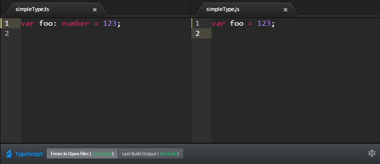

# Getting Started With TypeScript

TypeScript compiles into JavaScript. JavaScript is what you are actually going to execute (either in the browser or on the server). So you are going to need the following: 

* TypeScript compiler (OSS available [in source](https://github.com/Microsoft/TypeScript/) and on [NPM](https://www.npmjs.com/package/typescript))
* A TypeScript editor (traditionally visual studio)
* Some build pipeline for a build server

Traditionally you would need to set all these up (and more) but we're trying to consolidate all this into a single Atom Package : [Atom-TypeScript](https://atom.io/packages/atom-typescript). The only thing you need to share and collaborate on TypeScript projects across platforms (Windows / Mac / Linux). 

So: 
* Install [atom](https://atom.io/).
* `apm install atom-typescript`
* Fire up atom. Wait for the message: `AtomTS: Dependencies installed correctly. Enjoy TypeScript ♥` **It may take up to 5 minutes for this message to appear. Be patient!**
 
Now create a new `.ts` TypeScript file and start hacking away. AtomTS will take care of compiling it to `.js` and create a default [`tsconfig.json` TypeScript project file](https://github.com/TypeStrong/atom-typescript/blob/master/docs/tsconfig.md) for you. 

With a dev setup out of the way lets jump into TypeScript syntax

# Why TypeScript
There are two goals of TypeScript: 
* Provider an *optional type system* for JavaScript.
* Provide features of future JavaScript version to current JavaScript engines.

We find it best to explain these in seperation. 

## The TypeScript type system