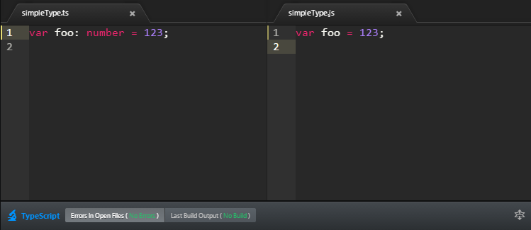

# Getting Started With TypeScript

TypeScript compiles into JavaScript. JavaScript is what you are actually going to execute (either in the browser or on the server). So you are going to need the following:

* TypeScript compiler (OSS available [in source](https://github.com/Microsoft/TypeScript/) and on [NPM](https://www.npmjs.com/package/typescript))
* A TypeScript editor (traditionally visual studio)
* Some build pipeline for a build server

Traditionally you would need to set all these up (and more) but we're trying to consolidate all this into a single Atom Package : [Atom-TypeScript](https://atom.io/packages/atom-typescript). The only thing you need to share and collaborate on TypeScript projects across platforms (Windows / Mac / Linux).



So:
1. Install [atom](https://atom.io/).
1. `apm install atom-typescript`
1. Fire up atom. Wait (around 5 mins) for the message: `AtomTS: Dependencies installed correctly. Enjoy TypeScript ♥`

Now create a new `.ts` TypeScript file and start hacking away. AtomTS will take care of compiling it to `.js` and create a default [`tsconfig.json` TypeScript project file](https://github.com/TypeStrong/atom-typescript/blob/master/docs/tsconfig.md) for you.

## Getting the Source Code
The source for this book is available in the books github repository https://github.com/basarat/typescript-book/tree/master/code most of the code samples can be copied in to atom-typescript and run as is. For code samples that need additional setup (e.g. npm modules), we will link you to the code sample before presenting the code. e.g.

`this/will/be/the/link/to/the/code.ts`
```ts
// This will be the code under discussion
```

## Nightly TypeScript
Instead of using the official *stable* TypeScript compiler we will be presenting a lot of new stuff in this book that may not be released. For this purpose we recommend using nightly typescript versions.

```
npm install -g typescript@next
```


With a dev setup out of the way lets jump into TypeScript syntax.


